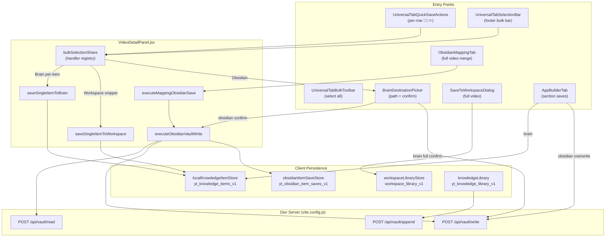
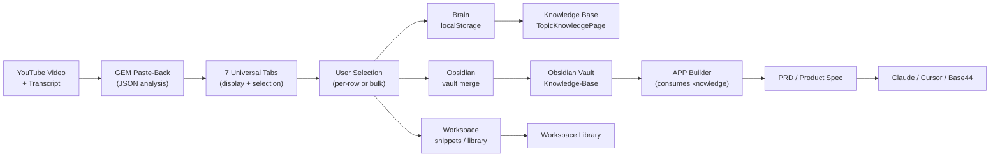

# SAVE SYSTEM ARCHITECTURE

```
SOURCE OF TRUTH

Future development must follow this document.

If implementation and documentation differ,
report the contradiction before modifying code.
```

**Project:** YouTube Mentor Dashboard  
**Orchestrator:** `VideoDetailPanel.jsx`  
**Last updated:** June 2026

---

## Overview

The save system supports **three primary destinations** plus a parallel **Knowledge Library**:

| Destination | Storage | Primary Store / API |
|-------------|---------|---------------------|
| **Brain** | localStorage + (full-video) Obsidian vault | `yt_knowledge_items_v1`, `/api/vault/write` |
| **Obsidian** | Obsidian vault + per-item tracking | `yt_obsidian_item_saves_v1`, `/api/vault/write?mode=merge` |
| **Workspace** | Snippets in knowledge store + full videos in library | `yt_knowledge_items_v1`, `workspace_library_v1` |
| **Knowledge Library** | Fixed vault pages + localStorage index | `yt_knowledge_library_v1`, `/api/vault/append` |

**Critical ambiguity:** "Brain" means two things:
1. **Per-item Brain** → `localKnowledgeItemStore` (fast access, in-app)
2. **Full-video Brain** → Obsidian vault write (durable archive)

UI labels both as "מוח" / 🧠. Future work should clarify terminology.

---

## Architecture Diagram — High Level



---

## Architecture Diagram — Knowledge Flow



---

## 1. Brain Save

### 1.1 Per-Row Brain Save

**Entry point:** 🧠 button on `UniversalTabQuickSaveActions.jsx`

**Flow:**

```
User clicks 🧠
  → bulkSelectionShare.onQuickSaveBrain(meta)
  → if already saved: openSavedBrainItem() → TopicKnowledgePage
  → else: saveSingleItemToBrain(text, tabKey, label)
  → upsertKnowledgeItem() in localKnowledgeItemStore
```

**Dedupe ID:** `brain-item:{videoId}:{tab}:{textKey}`  
`textKey` = first 60 characters, normalized.

**Workspace path hint:** `{topicName}/{sourceTab}/{videoSlug}/{slug}.md`

### 1.2 Bulk Brain Save

**Entry point:** 🧠 in `UniversalTabSelectionBar` footer

**Flow:**

```
handleSaveSelectedToBrain()
  → if App Builder tab: appBuilderBulkRef.saveBrain() (special handler)
  → else: loop multiSelected items
  → skip items with sectionKey (App Builder sections)
  → saveSingleItemToBrain() per item
```

### 1.3 Full-Video Brain Save

**Entry point:** Toolbar "שמור למוח"

**Flow:**

```
handleSaveAllToBrain()
  → open BrainDestinationPicker (variant=brain)
  → onConfirm: buildSaveAllContent()
  → POST /api/vault/write (mode=overwrite)
  → persistVerifiedVaultWriteStatus()
  → update video.obsidianSavedStatus
```

**Scope limitation:** `buildSaveAllContent()` collects **legacy fields only** (`keyInsights`, `keyPoints`, chapters, notes) — **not** universal tabs / GEM data.

### Key Files

| File | Role |
|------|------|
| `VideoDetailPanel.jsx` | Orchestration |
| `localKnowledgeItemStore.js` | `upsertKnowledgeItem`, `hasKnowledgeItem` |
| `saveStatusResolver.js` | `resolveBrainSaveStatus` |
| `BrainDestinationPicker.jsx` | Path selection |
| `brainStructure.js` | SubBrain folder suggestions |

---

## 2. Obsidian Save

### 2.1 Per-Row Obsidian Save

**Entry point:** 🔮 button on `UniversalTabQuickSaveActions.jsx`

**Flow:**

```
User clicks 🔮
  → saveSingleItemToObsidian(meta)
  → set pendingObsidianRowSave
  → open BrainDestinationPicker (variant=obsidian)
  → onConfirm: executeObsidianVaultWrite({ mode:'merge', mergeItems:[one] })
  → markObsidianRowSaved()
  → recordObsidianItemSave() in obsidianItemSaveStore
```

### 2.2 Bulk Obsidian Save

**Entry point:** Obsidian button in `UniversalTabSelectionBar` footer

**Flow:**

```
handleBulkObsidianForTab() / handleSaveSelectedToObsidian()
  → open BrainDestinationPicker
  → filter unsavedBulkItems (skip already saved)
  → if all saved: open existing file only
  → else: executeObsidianVaultWrite({ mode:'merge', mergeItems })
  → recordObsidianItemSave() per item
```

### 2.3 Full-Video Obsidian Save (Mapping)

**Entry point:** Obsidian Mapping tab → save action

**Flow via `executeMappingObsidianSave`:**

| Mode | Behavior |
|------|----------|
| `replaceExisting` | Overwrite with `buildVideoFullNote()` |
| `saveEntireVideo=false` + selection | Merge selected items only |
| Default | `buildVideoObsidianMergeItems()` — all universal tabs + legacy + notes + app builder draft |

**Package preview:** `collectVideoKnowledgePackage()` — UI checkbox "save entire video"

### 2.4 Merge Engine

**Client:** `obsidianVaultMergeWrite.js`  
**Server:** `vite.config.js` vault plugins

**Merge steps:**

```
1. POST /api/vault/read — get existing file content
2. mergeItemsIntoObsidianNote() — for each item:
   a. Build marker: <!-- obsidian-item:{identityKey} -->
   b. If marker exists in file → skip (dedupe)
   c. Else insert bullet under matching ## sectionLabel
3. POST /api/vault/write mode=merge
4. Fallback: mode=merged-content if server merge fails
5. Verify: every identityKey appears in returned content
6. recordObsidianItemSave() for each successful item
```

**Marker format:**

```html
<!-- obsidian-item:video123:insights:abc123hash -->
- Insight text here
```

### 2.5 Dedupe (Three Layers)

| Layer | Key | Behavior |
|-------|-----|----------|
| Vault file | HTML comment marker per `identityKey` | Skip insert if exists |
| Item store | `obsidian-item:...:{section}@{destinationPath}` | UI "saved" state |
| Identity | `videoId + tabKey + sectionKey + text hash (60 chars)` | Stable across saves |

**Identity builder:** `buildObsidianItemIdentityKey()` in `obsidianItemSaveStore.js`

### 2.6 Routing

| Route Type | Resolver |
|------------|----------|
| Video-level | `resolveVideoObsidianRoute(video)` → `{category}/{subCategory}/V-{slug}.md` |
| Keyword atomic | `FOLDER_KEYWORD_RULES` in `obsidianExport.js` |
| Picker override | User-selected path in `BrainDestinationPicker` |
| Taxonomy | `resolveObsidianFolderFromTaxonomy()` |

### Key Files

| File | Role |
|------|------|
| `obsidianNoteMerge.js` | `mergeItemsIntoObsidianNote`, markers |
| `obsidianVaultMergeWrite.js` | Read/write orchestration |
| `obsidianItemSaveStore.js` | Per-item tracking |
| `obsidianRouting.js` | Path resolution |
| `obsidianVideoMergeItems.js` | Full-video item collection |

---

## 3. Workspace Save

### 3.1 Per-Row Workspace Save (Snippets)

**Entry point:** ⭐ button on `UniversalTabQuickSaveActions.jsx`

**Flow:**

```
saveSingleItemToWorkspace(text, tabKey, label)
  → upsertKnowledgeItem() with id: ws-item:{videoId}:{tab}:{textKey}
  → path hint: Workspace/קטעים/{videoTitle}/{section}.md
```

**Note:** Uses same `localKnowledgeItemStore` as Brain — different ID prefix.

### 3.2 Bulk Workspace Save

**Entry point:** ⭐ in footer bar

**Flow:**

```
handleSaveSelectedToWorkspace()
  → creates ws-sel:...:{Date.now()} IDs
  → NO DEDUPE — duplicates on repeated bulk saves (known risk)
```

### 3.3 Full-Video Workspace Save

**Entry point:** `SaveToWorkspaceDialog.jsx`

**Flow:**

```
saveWorkspaceItem(video, topicMapping)
  → workspace_library_v1 store
  → dedupe by videoId (update existing)
  → updateLocalVideo()
  → updateKnowledgeItemsForVideo()
```

### Key Files

| File | Role |
|------|------|
| `workspaceLibraryStore.js` | `saveWorkspaceItem`, `isVideoInWorkspaceLibrary` |
| `useWorkspaceLibrary.js` | React hook |
| `SaveToWorkspaceDialog.jsx` | Full video dialog |

---

## 4. Bulk Save System (§22)

### Components

| Component | Role |
|-----------|------|
| `UniversalTabBulkContext.jsx` | Selection context provider |
| `useTabBulkSelection.js` | Set-based selection, clears on tab change |
| `UniversalTabBulkToolbar.jsx` | Select all / clear |
| `UniversalTabSelectionBar.jsx` | Footer save bar |
| `TabBulkItemsRegistrar.jsx` | Registers items per tab |
| `universalTabBulkItems.js` | `buildBulkItemsFromSections`, formatters |

### Tab-Specific Bulk Builders

| Tab | Builder |
|-----|---------|
| summary | `buildPoliticalSummaryBulkItems`, `buildSummaryBriefingBulkItems` |
| chapters | `buildChaptersBulkItems` |
| insights / useful-knowledge / topics | `UniversalTabSectionBlocks` + `buildBulkItemsFromSections` |
| specialized | `buildMorningBriefBulkSections` |
| app-builder | `AppBuilderTab` + `TabBulkItemsRegistrar` |

### Wiring

```javascript
// VideoDetailPanel.jsx
bulkSelectionShare = {
  onQuickSaveBrain,
  onQuickSaveObsidian,
  onQuickSaveWorkspace,
  isBrainItemSaved,
  isObsidianItemSaved,
  resolveWorkspaceSaveStatus,
}

BulkSelectionBar equivalent:
UniversalTabSelectionBar(
  onBrain={handleSaveSelectedToBrain}
  onWorkspace={handleSaveSelectedToWorkspace}
  onObsidian={handleBulkObsidianForTab}
)
```

---

## 5. Full-Video Save Comparison

| Path | Trigger | Engine | Content Scope |
|------|---------|--------|---------------|
| Brain full | "שמור למוח" | Overwrite vault | Legacy fields only |
| Obsidian mapping | Mapping tab save | Merge or overwrite | Universal tabs + legacy + notes + app builder |
| Obsidian replace | Picker allowReplaceExisting | Overwrite | `buildVideoFullNote()` |
| Workspace full | SaveToWorkspaceDialog | Library store | Video metadata + topic mapping |
| Knowledge video item | `createKnowledgeItemFromVideo` | localStorage | Atomic knowledge from video fields |

**Critical gap:** Brain full save ≠ Obsidian mapping full save in content scope.

---

## 6. APP Builder Save (Special Case)

| Action | Behavior | Path |
|--------|----------|------|
| Save to Brain | Section-level via ref | `localKnowledgeItemStore` |
| Save to Obsidian | **Overwrite** (not merge) | `App Ideas/{topic}/...` |
| Bulk Brain | `appBuilderBulkRef.saveBrain()` | Skips general bulk handler |
| Market app ideas | Vault append | `appIdeasBrainObsidian.js` |

**Paths:** `App Ideas/Stock Market/`, `App Ideas/Market App Brain/` per topic.

---

## 7. Knowledge Library (Parallel System)

**Not the same as Brain save** — fixed vault pages for evergreen knowledge.

| Property | Value |
|----------|-------|
| Root | `שוק ההון/ספריית ידע/` |
| Store | `yt_knowledge_library_v1` |
| API | `/api/vault/append` |
| Dedupe | Normalized text equality per page |
| Mapping | `SECTION_FILE_MAP` (definitions→מושגים.md, rules→כללים.md) |

**File:** `knowledgeLibrary.js`

---

## 8. Entry Points Summary

```
VideoDetailPanel.jsx                    ← central orchestrator
├── bulkSelectionShare                  ← per-row quick save handlers
├── UniversalTabSelectionBar            ← bulk footer bar
├── UniversalTabBulkToolbar             ← select all
├── BrainDestinationPicker              ← Obsidian + Brain full path
├── SaveToWorkspaceDialog               ← full video workspace
├── ObsidianMappingTab                  ← mapping full save trigger
├── AppBuilderTab                       ← section brain/obsidian + bulk ref
└── KnowledgeBrainSections              ← legacy brain toolbar

UniversalTabQuickSaveActions            ← per-row UI (🧠🔮⭐)
UniversalTabBulkProvider                ← selection context
obsidianVaultMergeWrite                 ← merge engine (client)
vite.config.js vault plugins            ← merge engine (server)
localKnowledgeItemStore                 ← Brain + Workspace snippets
workspaceLibraryStore                   ← Workspace Library videos
obsidianItemSaveStore                   ← Obsidian per-item tracking
knowledgeLibrary                        ← fixed library pages
```

---

## 9. Current Risks

| # | Risk | Severity | Mitigation |
|---|------|----------|------------|
| 1 | "Brain" dual meaning | Medium | Document clearly; future UI rename |
| 2 | Bulk Workspace duplicates | Medium | Fix `Date.now()` ID generation |
| 3 | Text hash collision (60 chars) | Low | Extend hash or use full text |
| 4 | Marker fragility | Medium | Warn users; marker repair tool |
| 5 | Download fallback (political) | Low | Migrate to vault merge |
| 6 | App Builder Obsidian overwrite | Medium | Document; consider merge |
| 7 | Brain full ≠ Obsidian full scope | High | Unify content collectors |
| 8 | Brain bulk skips sectionKey | Low | By design for App Builder |
| 9 | fileExistsButItemUnsaved | Medium | Reconcile obsidianSavedStatus vs item store |
| 10 | Dev-only vault API | **High** | Production backend for Base44 |
| 11 | OBS-1 draft not persisted | Medium | Wire mapping draft to DB |
| 12 | Partial bulk failure | Low | No rollback; atomic per write |

---

## 10. QA Scripts

| Script | Tests |
|--------|-------|
| `scripts/ui-row-merge-diagnostic.mjs` | Per-row Obsidian merge flow |
| `scripts/obsidian-merge-vault-qa.mjs` | Shared merge QA |
| `scripts/obsidian-bulk-save-qa.mjs` | Bulk vault write |
| `e2e/obsidian-item-save.qa.spec.js` | Per-row + mixed bulk |
| `e2e/obsidian-bulk-save.qa.spec.js` | Bulk + App Builder tab |
| `scripts/universal-tab-bulk-validate.mjs` | Brain/Obsidian/Workspace per tab |

---

## 11. Production Considerations

For Base44 publish:

1. `/api/vault/read`, `/api/vault/write`, `/api/vault/append` need production equivalents.
2. Vault path must be configurable via environment (not hardcoded dev path).
3. Brain localStorage should sync to backend (see `OBSIDIAN_PERSONAL_BRAIN_PHASE.md` next phase).
4. Merge engine must run server-side with same marker format for cross-device dedupe.

---

*For UX placement rules see `DESIGN_SYSTEM_AND_UX_RULES.md`. For architectural rationale see `PROJECT_DECISIONS_HISTORY.md` §4.*
